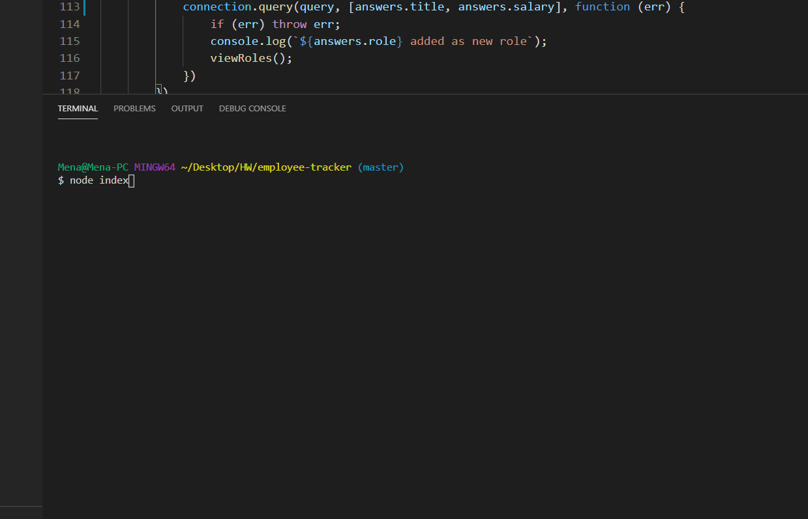

# **Employee Tracker**

* [Description](description)

* [Installation](installation)

* [Information](information)

## Description
An app that allows the user to create, view and delete tables to aid with keeping track of employees within the useres company. 
## Installation
Download the program from git hub and install all the required modules by typing npm intall in the terminal. In mysql, start a server and run the tables needed as well as the existing seeds to have them populate. When complete, in the terminal, type "node index" to start the program to use the existing features. 
## Information
Added bellow is an example of how this program can be used. 

